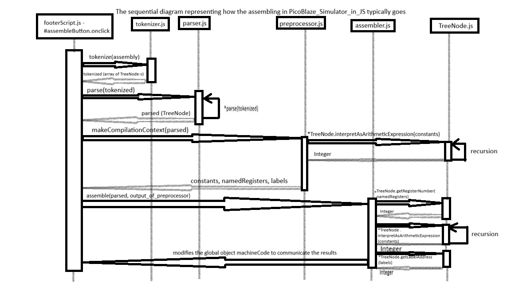

# PicoBlaze Assembler and Emulator in JavaScript


This is my attempt to implement a [Xilinx PicoBlaze](https://en.wikipedia.org/wiki/PicoBlaze) assembler and emulator in JavaScript. My Computer Architecture professor Ivan Aleksi asked me to make it if physical laboratory exercises need to be canceled because of a pandemic, so that students can do the laboratory exercises in spite of not having access to a real PicoBlaze. Fortunately, thus far, that hasn't happened.

It is available live on [SourceForge](https://picoblaze-simulator.sourceforge.io/). If that doesn't work (for instance, if I got a cross-site scripting attack), the front-end-only version is available on [GitHub Pages](https://flatassembler.github.io/PicoBlaze/PicoBlaze.html). As the assembler is written in JavaScript, rather than in PHP, the basic functionality is available even in the front-end-only version. The fork of this program maintained by @agustiza (Agustin Izaguirre) is available [live on his website](https://agustiza.github.io/PicoBlaze_Simulator_in_JS/PicoBlaze.html).

<del>Right now, this program has no back-end. Maybe I will add some back-end to enable users to share their own examples and comment on other users' examples later, but, for that, I will need to learn quite a bit of PHP, and it will work only on SourceForge because GitHub Pages supports no back-end scripting.</del> Abidin Durdu (known as @abdrd on GitHub) has made a simple back-end allowing the users to upload their own PicoBlaze assembly programs. It uses MySQL and is running on the SourceForge servers.

<del>The documentation, in Croatian, is available in the `seminar` folder, in DOCX, DOC, ODT, PDF and [RTF](https://flatassembler.github.io/PicoBlaze/PicoBlaze.rtf) formats.</del> (UPDATE: I received a message telling me that hosting the documentation on my website and my GitHub profile is a copyright infringement. So, the [documentation, in Croatian, is available on DABAR in the PDF format](https://repozitorij.etfos.hr/islandora/object/etfos:4489/datastream/PDF/download).)

If you want to host this project yourself, you might want to edit the lines following the [17th line of the `PicoBlaze.html` file](https://github.com/FlatAssembler/PicoBlaze_Simulator_in_JS/blob/6e28dd2b8ce3c8344bf223ced8983b5eb2fb2eb5/PicoBlaze.html#L17):
```html
<script>
  var URL_of_JSON_with_examples =
      "https://flatassembler.github.io/PicoBlaze/examples.json",
    URL_prefix_of_the_examples =
      "https://raw.githubusercontent.com/FlatAssembler/PicoBlaze_Simulator_in_JS/master/";
</script>
```
and modify them to point to where you will host the examples.

An example of a similar project is [FRISC JS](https://github.com/izuzak/FRISCjs). Here at the University of Osijek, we are using PicoBlaze as an example of a simple computer, but, at the University of Zagreb, they are using FRISC for that. And their students made an assembler and emulator for FRISC in JavaScript, though I guess it's not for the same reason I made PicoBlaze assembler and emulator in JavaScript (the FRISC JS project predates the pandemic by many years).

**Note to the contributors**: While there are some JEST tests in this project (made mostly by @agustiza), the test coverage is pretty low, so don't rely solely on them. Please do some manual testing. And, if possible, do that manual testing in Firefox 52 (the last version of Firefox to work on Windows XP, and it's also the version of Firefox that comes with Solaris 11.4), as it is important to me not to break the compatibility with Firefox 52. Many computers at my university are running Windows XP and are using Firefox 52 as the browser, and it is important to me that this program works on those computers.

**UPDATE** on 24/01/2021: I've started developing [a version of this app for Android](https://github.com/FlatAssembler/PicoBlaze_Simulator_for_Android). As I am not a skilled Android developer, any help will be appreciated.

**UPDATE** on 18/07/2023: I have started a [forum.hr thread](https://www.forum.hr/showthread.php?t=1336407) where I listed non-trivial problems I currently have with my PicoBlaze Simulator.

**UPDATE** on 05/07/2024: I've made [a YouTube video about this program](https://youtu.be/ckAvsglxTVc).

**UPDATE** on 08/05/2025: The documentation is once again available in the *seminar* folder.

[](https://lgtm.com/projects/g/FlatAssembler/PicoBlaze_Simulator_in_JS/context:javascript)
[](https://github.com/prettier/prettier)

## The diagram explaining how the assembling works

Here is a sequential diagram explaining how the assembling of the assembly code into machine code is supposed to work:



## Star History

[](https://www.star-history.com/#FlatAssembler/PicoBlaze_Simulator_in_JS&type=date&legend=top-left)
