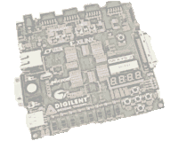

# PicoBlaze Assembler and Emulator in JavaScript



This is my attempt to implement a [Xilinx PicoBlaze](https://en.wikipedia.org/wiki/PicoBlaze) assembler and emulator in JavaScript. My Computer Architecture professor Ivan Aleksi asked me to make it in case physical laboratory exercises need to be canceled because of a pandemic. You can see the assembler and the emulator live on [my website](https://flatassembler.github.io/PicoBlaze/PicoBlaze.html) and on [SourceForge](https://picoblaze-simulator.sourceforge.io/) (let's hope it will never happen that both of them are down right when you need a PicoBlaze assembler and emulator). I try my best to make it work on both places in Firefox 52 and newer browsers at all times. Or, if you want to try the version which has more features, but potentially has bugs, you can try [where a version of this program is hosted on @agustiza's website](https://agustiza.github.io/PicoBlaze_Simulator_in_JS/PicoBlaze.html).

Right now, this program has no back-end. Maybe I will add some back-end to enable users to share their own examples and comment on other users' examples later, but, for that, I will need to learn quite a bit of PHP, and it will work only on SourceForge because GitHub Pages supports no back-end scripting.

<del>The documentation, in Croatian, is available in the `seminar` folder, in DOCX, DOC, ODT, PDF and [RTF](https://flatassembler.github.io/PicoBlaze/PicoBlaze.rtf) formats.</del> (UPDATE: I received a message telling me that me hosting the documentation on my website and my GitHub profile is a copyright infringement. So, the [documentation, in Croatian, is available on DABAR in the PDF format](https://repozitorij.etfos.hr/islandora/object/etfos:4489/datastream/PDF/download).)

If you want to host this project yourself, you might want to edit the lines following the [17th line of the `PicoBlaze.html` file](https://github.com/FlatAssembler/PicoBlaze_Simulator_in_JS/blob/6e28dd2b8ce3c8344bf223ced8983b5eb2fb2eb5/PicoBlaze.html#L17):
```html
<script>
  var URL_of_JSON_with_examples =
      "https://flatassembler.github.io/PicoBlaze/examples.json",
    URL_prefix_of_the_examples =
      "https://raw.githubusercontent.com/FlatAssembler/PicoBlaze_Simulator_in_JS/master/";
</script>
```
and modify them to point to where you will host the examples.

**Note to the contributors**: While there are some JEST tests in this project, the test coverage is pretty low, so don't rely solely on them. Please do some manual testing. And, if possible, do that manual testing in Firefox 52 (the last version of Firefox to work on Windows XP, and it's also the version of Firefox that comes with Solaris 11.4), as it is important to me not to break the compatibility with Firefox 52. Many computers at my university are running Windows XP and are using Firefox 52 as the browser, and it is important to me that this program works on those computers.

**UPDATE** on 24/01/2021: I've started developing [a version of this app for Android](https://github.com/FlatAssembler/PicoBlaze_Simulator_for_Android). As I am not a skilled Android developer, any help will be appreciated.

**UPDATE** on 18/07/2023: I have started a [forum.hr thread](https://www.forum.hr/showthread.php?t=1336407) where I listed non-trivial problems I currently have with my PicoBlaze Simulator.

[](https://lgtm.com/projects/g/FlatAssembler/PicoBlaze_Simulator_in_JS/context:javascript)
[](https://github.com/prettier/prettier)
